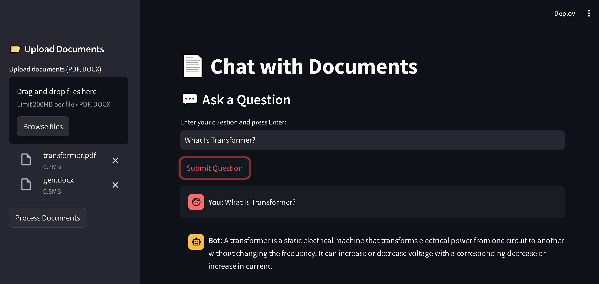

# AI-Powered Document Chat



## Overview
This Streamlit application allows users to interact with multiple document types (PDF, DOCX, TXT) using AI-powered conversational capabilities. The app extracts text from uploaded documents, processes them into vector embeddings, and enables users to ask questions, receiving context-aware responses.

## Features
- **Upload and Process Multiple Documents**: Supports PDF, DOCX, and TXT files.
- **Persistent Storage**: Uploaded documents are stored locally for processing.
- **AI-Powered Q&A**: Uses Google Gemini API and FAISS vector store for intelligent document search and response generation.
- **Interactive Chat Interface**: Users can ask questions and receive AI-generated responses based on document content.
- **Chunk-Based Processing**: Splits large documents into manageable text chunks for efficient searching.

## Installation
### Prerequisites
Ensure you have Python installed along with the required dependencies.

### Steps
1. Clone the repository:
   ```sh
   git clone https://github.com/PriyanshuDey23/Chat-with-Documents.git
   cd document-chat
   ```
2. Install dependencies:
   ```sh
   pip install -r requirements.txt
   ```
3. Set up environment variables:
   - Create a `.env` file in the root directory.
   - Add your Google API key:
     ```sh
     GOOGLE_API_KEY=your_api_key_here
     ```

## Usage
1. Run the application:
   ```sh
   streamlit run app.py
   ```
2. Upload your documents (PDF, DOCX, TXT) using the sidebar.
3. Click **Process Documents** to extract and store text in the vector database.
4. Ask questions in the chat interface and receive AI-generated responses.
5. Click **Submit Question** to process your input.

## Technologies Used
- **Streamlit**: Interactive UI for document processing and Q&A.
- **Google Gemini API**: AI-powered conversational responses.
- **FAISS**: Efficient similarity search for document embeddings.
- **PyPDF2**: PDF text extraction.
- **python-docx**: DOCX text extraction.

## Future Enhancements
- Add support for more document formats (e.g., Excel, HTML).
- Improve response generation with advanced fine-tuned models.
- Implement cloud storage for uploaded files.

## License
This project is licensed under the MIT License.


